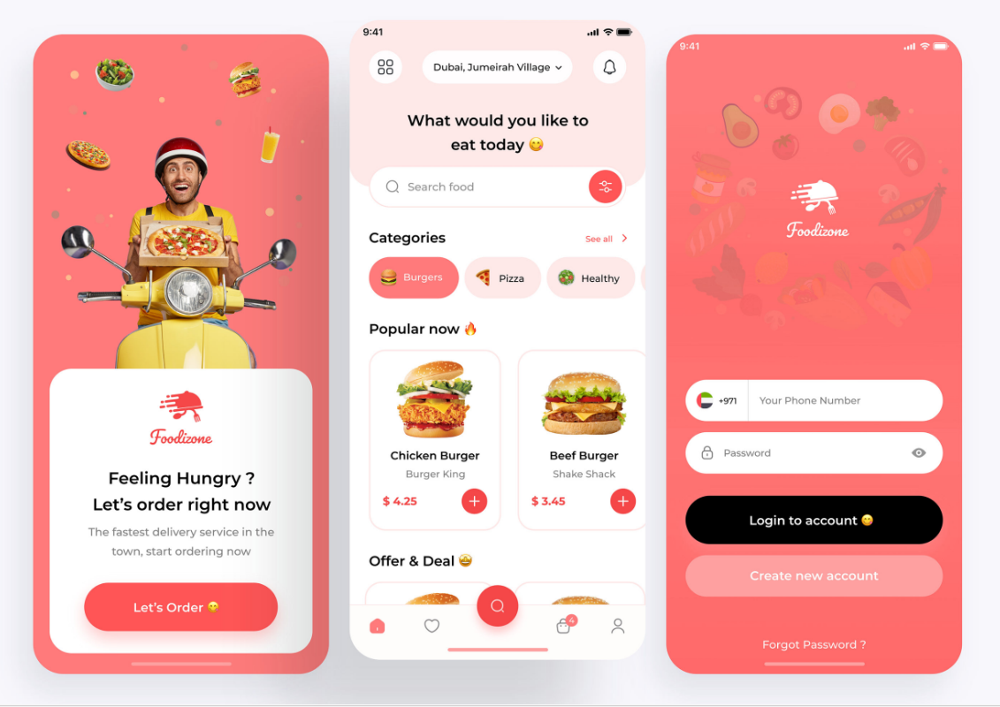

# 🍔 Foodizone - Food Delivery Android Application

Foodizone adalah aplikasi **Food Delivery** berbasis Android yang dikembangkan menggunakan **Kotlin** di **Android Studio**. Aplikasi ini dirancang untuk memberikan pengalaman pemesanan makanan yang modern, mudah digunakan, dan memiliki antarmuka yang menarik.

## 📱 Preview


---

## 📖 About the Project

Foodizone merupakan aplikasi mobile yang mensimulasikan layanan pemesanan makanan secara online. Pengguna dapat menjelajahi berbagai kategori makanan, melihat menu populer, mencari makanan, serta mengakses halaman autentikasi melalui antarmuka yang sederhana dan intuitif.

Proyek ini dikembangkan sebagai implementasi pengembangan aplikasi Android menggunakan bahasa pemrograman Kotlin dengan Android Studio.

---

## ✨ Features

- 🍔 Browse food categories
- 🔍 Search food menu
- 🔥 Popular food recommendations
- 💰 Offers & Deals section
- 📍 Location selection
- 🔐 User login interface
- 📱 Modern and responsive UI
- ⚡ Smooth navigation between screens

---

## 🛠️ Tech Stack

| Technology | Description |
|------------|-------------|
| Kotlin | Main programming language |
| Android Studio | IDE for Android Development |
| XML | User Interface Layout |
| Gradle | Build Automation Tool |
| Material Design | UI Components & Design Guidelines |

---

## 📂 Project Structure

```
Foodizone/
│── app/
│── gradle/
│── build.gradle
│── settings.gradle
│── README.md
│── Preview.png
```

---

## 🚀 Getting Started

### Prerequisites

- Android Studio
- JDK 17 (or compatible version)
- Android SDK

### Installation

1. Clone this repository

```bash
git clone https://github.com/ilhmtnzl/Aplikasi-Foodizone.git
```

2. Open the project using Android Studio.

3. Wait until Gradle finishes syncing.

4. Run the application on an Android Emulator or a physical Android device.

---

## 📸 Application Screens

- 🚀 Splash Screen
- 🏠 Home Screen
- 🔐 Login Screen

---

## 🎯 Purpose

This project was developed to:

- Practice Android application development using Kotlin.
- Implement modern mobile UI principles.
- Improve Android Studio development skills.
- Build a functional prototype of a food delivery application.

---

## 👨‍💻 Author

**Ilham Tanzilal Aziizir**

- GitHub: https://github.com/ilhmtnzl

---

⭐ If you find this project useful, consider giving it a star!
